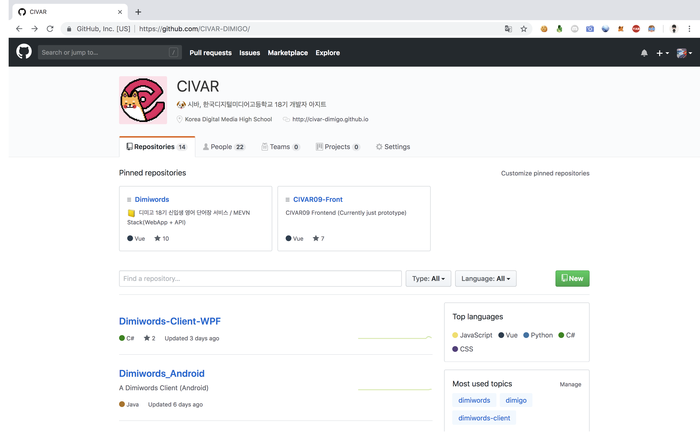
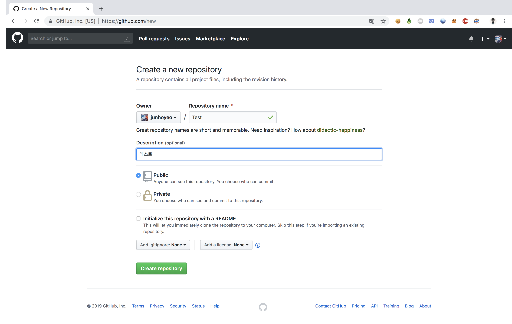
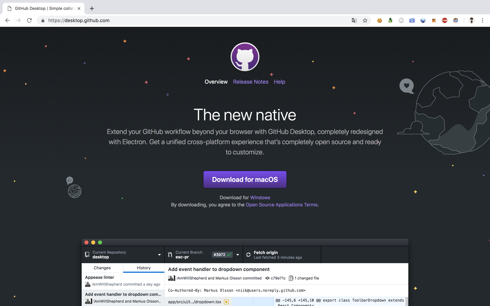
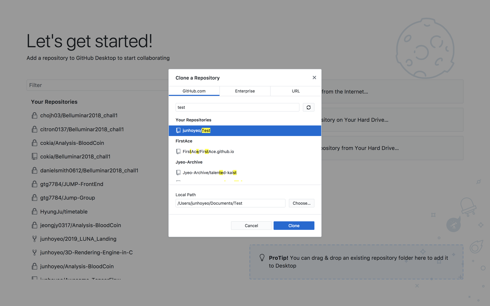
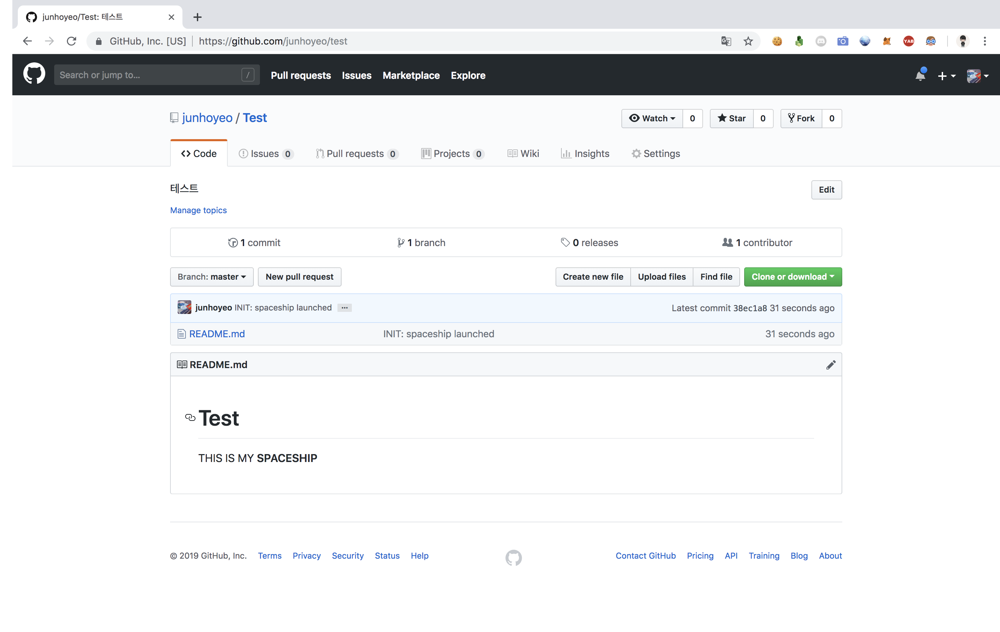

# 001. Github
전 세계의 개발자들이 코드와 프로젝트를 공유하는 Github에 대해서 알아봅시다.

## 프롤로그
아마 이전에 프로젝트를 해본 분들도 계실 거예요. 꼭 개발이 아니더라도요.

보통 개발이나 영상이나 뭘 만들게 되면 보통 처음에 노가다해서 조금씩 만들고 또 수정하고 또 추가하고, 그러다가 지우는 부분도 있고... (무한반복) 하면서 원하는 결과물에 다가가게 됩니다.

그런데 하다 보면 `아씨 이거 왜 추가했지? 미운데?` 라던가 `이전 버전으로 돌릴 걸 그랬어ㅜㅜ` 같은 생각이 나오게 됩니다.

그러니까 약간 예시를 쉽게 들자면(*준호피셜 주의*), 저는 어릴 때 레고를 좋아했는데요(물론 밟으면 기분이 나빴습니다).

> 어느 날, 준호는 레고로 멋진 우주선을 만들었어요!
> 
> 그런데 우주선의 디자인이 뭔가 부족한 듯 싶어서 블록을 추가하기로 했어요.
> 
> 준호: `허걱쓰,,, 추가했더니 더 이상해진 것 같아...`
> 
> 준호: `이전 버전으로 돌리고 싶다!`
> 
> 그러나 유감스럽게도 준호는 블록을 추가하기 전의 우주선이 어떻게 생겼는지 **기억나지 않았어요.**
> 
> 결국 준호는 우주선을 다시 뜯어고쳐야 했답니다.

허걱! 내 우주선, ㅜ.ㅜ

그래서 보통은 이렇게 생각했을 수도 있어요. `와! 버전별로 폴더를 만들어서 뭐가 바뀔 때마다 이렇게 해야겠어!`

그런데 이게 여간 귀찮은 게 아닙니다(경험담). 새로운 폴더를 만드는 백업 주기를 정하는 것도 어렵고요.

게다가 몇 가지 문제점이 더 생겼어요.

> 상윤이는 준호의 끔찍한 우주선을 멀리서 처다보고 있었어요.
> 
> 상윤: `아니;; 어떻게 저렇게 흉측한 우주선을 만들 수 있지!`
> 
> 상윤이는 준호에게 참교육을 시전하기로 했어요.
> 
> 상윤: `준호야 나랑 같이 만들지 않을래?`
> 
> 준호: `헉 상윤아 고마워,,, 역시 너밖에 없어!`
> 
> 상윤: `하하! 계획 성공!`
> 
> 그렇게 준호와 상윤이는 **협업**을 진행하게 되었어요.
> 
> 그런데, 문제가 발생했답니다.
> 
> 준호: `와 여기에 이 블록을 놓아야겠다.`
> 
> 상윤: `여기에 이걸 놓으면 좀 엘레강스틱해 보이겠는걸!`
> 
> `(쾅! 내가 놓을 거야 저리 비켜)`하고 **충돌** 발생
> 
> 헉! 여러 명의 사람들이 한 프로젝트를 하다 보니 서로 생각도 다르고, 진행하는 부분도 달라서 충돌이 발생했어요.
> 
> 그렇게 우주선 프로젝트는 망하는 걸까요!

그리고 몇 가지 문제가 더 있었으니...

> 다행히도 결국 우주선은 살아남았어요. 
> 
> 나린: `와 뭐야뭐야 나도 우주선 만들기 할래`
> 
> 상윤: `그래 나린아 내가 끼워 줄게`
> 
> 나린: `그..그래;; 정말 고마워`
> 
> 그날 밤이였어요.
> 
> 준호: `(우주선을 살펴본다) 엥... 구... 구르기? ㄱ... 감자 미사일?`
> 
> 준호: `뭐야 누가 우주선에 이런 이상한 기능들을 만든 거야!`
> 
> 나린: `헉 난 아니야! 아마 상윤이가 아닐까?`
> 
> 상윤: `? 가.. 갑자기..? 나도 아니야!`

우리 친구들은 누가 그랬는지 알 것 같나요? (온화한 웃음)

프로젝트를 여러 사람들이 진행하면서 생길 수 있는 이런 문제들을 해결해 주기 위해서 나온 것이 바로 `git`이랍니다.

그럼, 우리 `git`에 대해서 더 알아볼까요? (두구두구 효과음)

## 1. git의 탄생
`리눅스마스터`라는 자격증이 있어요. 이걸 따면 디미고 입학 가산점이 무려 1점입니다! ~~근데 저는 이게 없었어요~~

우리 모두 지망생의 순수한 마음으로 돌아가 보면 `리눅스? 이게 뭔데 1점이나 주는 거지? 한글이랑 좀 다른가?`라고 생각해 볼 수 있을 거예요. 리눅스는 `리누스 토르발스`라는 사람이 만든 운영체제예요. 약간 윈도우 같은 거라고 생각하면 됩니다.

근데 이게 오픈소스라서, 누구나 코드를 읽고 수정하고 쓸 수 있게 공개되어 있어요. 그래서 사람들이 `헐 뭐야 나도나도` → `오예 나 이제 리눅스에 기여한거야(자부심 레벨 업)` → `와;; 너 좀 쩌는데? 나도 해보고 싶다`, 이런 식으로 점점 기능을 추가해 나가면서 막강해진 거예요. 그리고 이런 이유로 다른 비싼 운영체제와 다르게 가격도 무료고, 사람들이 좋아하다 보니 파생된 버전도 많고 하다 보니 서버 쪽에서는 많이 쓰인답니다.

리누스도 처음에 우리의 우주선 프로젝트처럼 기여한 사람들이 보내는 이메일 리스트로 나름 버전 관리를 하다가 점점 복잡해지니 `BitKeeper`라는 상용 프로그램을 사용하게 됩니다. 그런데 BitKeeper 측이 무료 제공을 중단, 리눅스 커뮤니티와 갈등이 생기게 되면서 결국 직접 만들어 쓰기로 결정합니다.

그리고 2주만에 `git`이라는 버전 관리 프로그램을 만들었습니다. 갓누스...

우리 시바들도 불편한 게 있으면 직접 2주만에 만들어 쓰는 사람이 되자고요! 와!

## 2. 그래서 git이란
`git`은 분산형 소스코드 버전 관리 시스템이예요.


> 희대의 망작, [디미워드](https://github.com/CIVAR-DIMIGO/Dimiwords)의 git 로그 

먼저 실제 코드가 저장되는 중앙 서버(원격 저장소-`remote server`)가 존재합니다. 여기에 여러 개의 컴퓨터들이 연결됩니다.

각각의 컴퓨터는 작업한 내용을 스테이지(`stage`)에 올려서 로컬 저장소에 커밋(`commit`)합니다. 

그 다음 커밋들을 푸시(`push`)해서 원격 저장소에 올립니다.

이와 반대로 다른 컴퓨터가 작업한 내용을 풀(`pull`)해서 변경 사항을 로컬 저장소로 동기화할 수 있어요.

이번에도 재미있는 예시를 통해서 설명해 볼게요.

> 준호와 친구들은 우주선 프로젝트에 git을 사용하기로 했어요.
> 
> 준호는 `spaceship.c` 파일을 새로 생성하고, 기존의 `space.txt` 파일의 맨 끝 줄을 지우고, `><`이라고 쓴 줄을 추가했어요.
> 
> ```diff
> + // spaceship.c
> + int main(void){puts("Space boom boom");}
> ```
>
> ```diff
> ** space.txt **
> 일하기싫다.
> 일해라.
> 이파일 누가만들었냐.
> - 여준호못생겼다.
> + ><
> ```
> 
> 준호: `와! 오늘도 힘들게 우주선을 코딩했는걸! ^~^ 역시 피시방은 개발하는 장소라고!`
> 
> **[system] 준호는 `git add .` 명령어를 이용해서 현재 변경사항을 스테이징했다!**
> 
> 준호: `이제 지금 스테이징된 수정 내용을 하나의 업데이트 단위(???)로 등록해야겠어!`
> 
> **[system] 준호는 `git commit -m "우주선 파일 업데이트"` 명령어를 입력했다!**
> 
> **[system] "우주선 파일 업데이트"라는 커밋이 생겼다!**
> 
> 준호: `작업을 좀 더 하고 몇 가지 커밋을 더 해야겠어.`
> 
> (...)
> 
> 준호: `헉헉 다했다. 이제 다른 친구들이 수정 사항을 확인할 수 있도록 원격 저장소에 올려야겠어.`
> 
> **[system] 준호는 `git push` 명령어를 이용해서 원격 저장소에 커밋들을 올렸다!**
> 
> 한편 매우 중요한 비즈니스 때문에 지구 반대편에 있던 상윤이...
> 
> 상윤: `혹시라도 변경 사항이 더 생겼나 확인해 봐야겠는걸.`
> 
> **[system] 상윤이는 `git pull` 명령어를 입력했다!**
> 
> 상윤: `오~!! 준호가 작업한 "우주선 파일 업데이트"라는 이름의 작업이 새로 들어왔네!`
> 
> 상윤이는 그렇게 노동을 했다고 합니다.

아무튼 이런 거예요.

그런데, 이상한 명령어를 쓰면서 하니까 왠지 조금 어려워 보이네요? 

걱정하지 마세요. 우리에게는 `Github Desktop`이라는 쩌는 GUI 프로그램이 있었으니... ~~어차피 나중에 다 배우게 되긴 하겠지만~~
 
## 3. Github란?
먼저 `Github`(이하 걍 깃허브)에 대해서 알아볼까요? 

대부분의 시바 멤버분들께서는 아마 ~~제가 초에 갈궈서~~ 깃허브 계정이 있을 거예요. 없다면 이 기회에 만드는 것도 고려해 보세요.
깃허브는 아까 말했던 git의 원격 저장소를 호스팅하는 사이트예요. 이와 동시에 이슈 트래커 등 여러가지 개발 프로세스에 힘을 실어주는 다양한 기능들이 있답니다.

깃허브에 올라오는 프로젝트들은 대부분 오픈소스입니다. 오픈소스 프로젝트는 위에서 잠깐 살펴봤던 리눅스와 git처럼 누구나 그 코드를 보고 수정, 사용할 수 있게 하는 프로젝트를 말해요. 

오픈소스로 코드를 공개하는 것 자체가 전세계의 개발 생태계에 기여하는 것이랍니다. 예를 들어서, 누가 코딩 중 모르는 게 있어서 구글링을 하다가 여러분이 올린 코드를 보고 새로운 걸 배워갈 수 있다는 것이죠.

그렇다고 해서 오픈소스에 저작권이 없는 것은 절대 아니예요. 오픈소스 역시 개발자가 규정한 라이센스 안에서만 사용할 수 있고, 이를 위반하게 되면 법적 분쟁으로 번질 수도 있어요. 오픈소스 라이센스는 `MIT`, `GNU`, `Apache` 등등이 있으니 [참고](https://help.github.com/articles/licensing-a-repository/)해 보세요!

그렇다면 먼저 같이 깃허브를 한 바퀴 돌아볼게요.

## 4. Github 살펴보기

### 사용자 프로필 


> CIVAR의 저장소에 스타를 다는 것보다 준호의 저장소에 스타를 다는 게 준호에게 돈(?)이 더 많이 들어옵니다.

먼저 자신의 프로필 페이지입니다. `https://github.com/(깃허브 아이디 이름)`으로 들어가면 해당 사용자의 프로필 페이지를 볼 수 있어요.

프로필 페이지에서는 자신(또는 다른 사용자)이 만든 저장소, 팔로워 그리고 팔로잉 정보 등을 확인할 수 있어요.


> 오예

아래쪽에 있는 그래프는 날짜별로 여러분이 깃허브 저장소에 한 커밋 수를 나타내요. 우리 모두 숲을 만들어나가 봅시다 ^~^

- `streak`는 며칠 연속으로 커밋을 했는지를 뜻해요. 약간 게임에서 콤보 같은 느낌입니다. `Longest streak`는 콤보 최고기록 같은 거라고 보면 되겠네요.
- `Busiest day`는 가장 바쁜 날에 몇 개의 커밋을 했는지를 보여줘요.
- 아래쪽에 어떤 단체(Organization)의 레포에 커밋을 했는지도 알 수 있답니다.
- 위 스크린샷처럼 컨트리뷰션 그래프를 3D로 보고 싶다면 [isometric-contributions](https://github.com/jasonlong/isometric-contributions)라는 플러그인을 이용해 보세요.

### 단체(Organization) 프로필



> 와! CIVAR!

여러 명이 비슷한 성격의 프로젝트를 진행하거나, 회사나 개발팀이 함께 작업하기 위해서 깃허브 오가니제이션(단체)을 만들기도 한답니다.
  
## 4. Github 저장소(레포) 만들기
그렇다면 직접 깃허브 저장소를 만들어 볼까요?


맨 오른쪽 위 메뉴에서 `+` 버튼을 눌러서, `New repository`로 가주세요.



이제 저장소 이름과 설명, 공개 여부를 설정하고 아래쪽 `Create repository` 버튼을 누르면 끝!

- `Initialize this repository with a README` 옵션을 선택하면 저장소 생성과 동시에 해당 저장소에 대한 정보를 작성할 수 있는 `README.md` 파일이 함께 생성된답니다.
- `.gitignore`는 버전 관리 시스템에 들어가지 않아도 되는 캐시 파일이나 민감한 정보가 적인 파일 등을 명시하는 설정 파일이예요. `Add .gitignore`를 이용해서 언어에 맞는 기본 `.gitignore` 파일을 생성할 수도 있답니다.
- `Add a license`를 이용해서 기본 라이센스 템플릿을 만들 수도 있어요.


야호! 저장소가 만들어졌어요!

## 5. Github Desktop



> 아마 보라색 버튼을 누르면 자신의 OS에 맞는 파일이 자동으로 다운로드될 거예요.

그럼 이제 `Github Desktop`을 설치하고 사용해 볼까요?

https://desktop.github.com/

[위 링크](https://desktop.github.com/)에 접속해서 여러분의 컴퓨터 운영체제에 맞는 프로그램을 다운로드하고 설치, 실행해 주세요!



> 새로 설치하면 아마 이런 화면이 안 나올 수 있지만, 큰 차이는 없을 거예요!

프로그램을 실행하고 이전에 만든 깃허브 아이디로 로그인을 하면 위와 같은 창이 나타날 거예요. `Clone a Repository from the Internet`과 같은 버튼을 눌러서 여러분이 만든 저장소를 클론해 주세요. `clone`은 말 그대로 원격 저장소를 여러분이 작업할 수 있도록 복제해 오는 개념이예요!


> 두둥

짠, 클론이 끝나면 아마 이런 화면이 뜰 거예요. 
`No local changes`, 즉 로컬에 있는 저장소 복제본이 변경된 내용이 없다는 뜻이예요. 


> `README.md` 파일을 추가해 보겠습니다.

이제 새로운 파일을 생성해 볼게요. 파일 탐색기나 텍스트 에디터 등으로 새로운 파일을 만들어 주세요.

위에서 저는 `README.md` 파일을 생성했습니다. `README.md` 파일은 프로젝트 




여러분은 이제 저장소를 만들고, 파일을 업로드할 수 있어요! 그렇다면 계속 진행하기 전에 자신의 개인 깃허브 계정에 새 저장소를 만들어서 컴퓨터 어딘가에 있을 작은 작업물을 올려 보는 건 어때요? 

## 더 알아보기
나중에 작업 예정입니다. ~~과연? 나머지는 그냥 검색해 봅시다! 와!~~

- `Pull Request` (PR, 풀 리퀘스트)
- `Branch` (브랜치)

이걸로도 많은 걸 할 수 있지만 CLI(커맨드 라인 인터페이스)~~네, 까만 화면에 흰 글자 말하는 거예요~~를 이용해서 하면 더 많은 것들을 더 자세하게 제어할 수 있답니다. 언젠가는 꼭 하게 될 거니까 관심이 있다면 꼭 알아봐 주세요.
